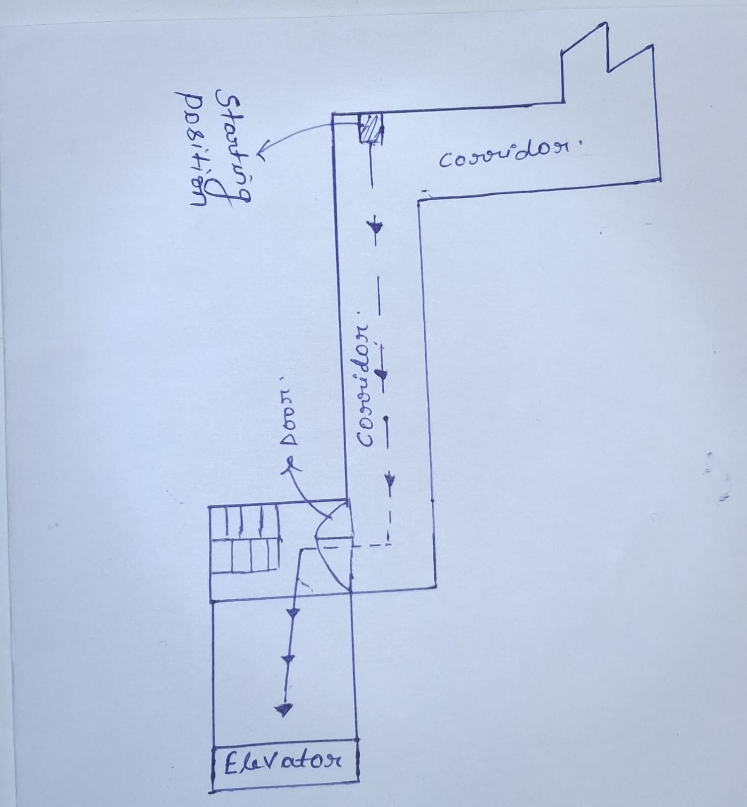
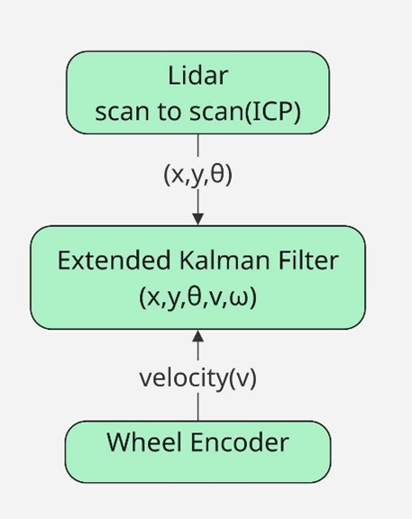
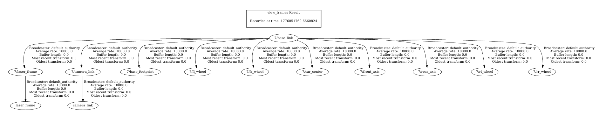
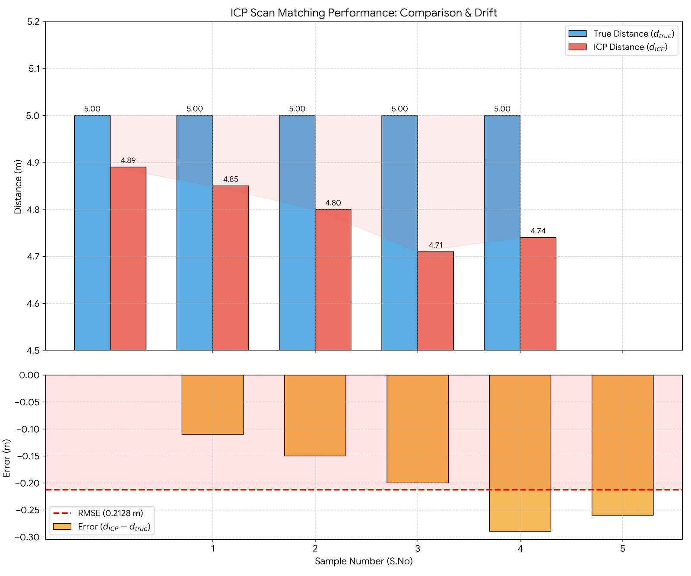

# ICP Scan-to-Scan Localization 

## Overview
This repository contains the experimental validation of scan-to-scan localization using the Iterative Closest Point (ICP) algorithm with 2D LiDAR data.

The objective of this work is to evaluate the accuracy and repeatability of pure ICP-based motion estimation in an indoor corridor environment.

At this stage, localization is performed exclusively using LiDAR scan matching, without wheel encoders, motion models, or sensor fusion.

---

## Physical Scenario for Project
- An autonomous mobile robot operates in hospital corridors to transport biohazardous waste. The robot navigates in straight paths, detects obstacles, stops when necessary, and resumes motion once the path is clear.
- The system uses a pure LiDAR-based scan-to-scan localization approach without any external tracking systems such as OptiTrack. Every 0.1 seconds (10 Hz), incoming LiDAR scans are matched with previous scans using ICP to estimate relative motion (Δx, Δy, Δθ).
- These incremental motions are accumulated to continuously estimate the robot’s relative pose [x, y, θ], enabling real-time onboard localization. This pose is used directly for navigation, obstacle handling, and motion control in the corridor environment.

---

  

  <em>Figure: Scenario </em>

``

## User Story: LiDAR Scan-to-Scan Motion Estimation

### Description
As a **user**, I want the robot to estimate its relative motion using **scan-to-scan LiDAR matching**, so that a **pose measurement can be generated onboard** without relying on external systems such as OptiTrack.

---
### Acceptance Criteria

- A new LiDAR scan is received at **10 Hz (every 0.1 seconds)**.
- Each incoming scan is matched with the **previous scan** using a scan matching algorithm.
- The system estimates the relative motion:
  - Δx (translation in x)
  - Δy (translation in y)
  - Δθ (rotation)
- The relative transformations are **accumulated over time** to compute the robot’s absolute pose:

---
## Localization Method

### Scan-to-Scan ICP
- Consecutive 2D LiDAR scans are aligned using the ICP algorithm  
- Each scan alignment produces a relative displacement  
- Relative displacements are accumulated to estimate total travelled distance  
- No odometry, motion prior, or external correction is applied  

Localization accuracy is evaluated solely by comparing ICP-estimated distance with the known ground-truth distance.

---
## Scope of This Work

  

  <em>Figure: LiDAR–Encoder based localization architecture</em>

``

### Included
- 2D LiDAR scan-to-scan ICP
- Relative motion estimation (Δx, Δy, Δθ)
- Accumulated displacement estimation
- Quantitative accuracy evaluation
- RMSE-based performance analysis
---
## Frame work
- odom → base_link → laser_frame
- All motion is estimated relative to the starting pose, not globally localized.
  

  

  <em>Figure: frames</em>

``

### Not Included
- Wheel encoder odometry  
- Kalman Filter / EKF  
- Sensor fusion  

This repository represents a **baseline evaluation** before introducing additional sensors or filtering techniques.

---

## Experimental Setup

- **Environment:** Indoor corridor  
- **Path length:** 5 meters (measured using a measuring tape)  
- **Motion:** Straight-line traversal  
- **Number of trials:** 5  
- **Ground truth:** Physical measurement of distance  

The experiment was repeated multiple times to ensure consistency and reliability of the results.

---

## Error Calculation

For each trial:

$$
Error = d_{ICP} - d_{true}
$$

Where:
- $d_{true} = 5.0 \, m$
- $d_{ICP}$ = distance estimated by ICP

## Root Mean Square Error (RMSE)

$$
RMSE = \sqrt{\frac{1}{N} \sum_{i=1}^{N} (d_{ICP,i} - d_{true})^2}
$$

## Experimental Results

| Trial | True Distance (m) | ICP Distance (m) | Error (m) | Squared Error (m²) |
|------|------------------|------------------|----------|--------------------|
| 1    | 5.00             | 4.89             | -0.11    | 0.0121             |
| 2    | 5.00             | 4.85             | -0.15    | 0.0225             |
| 3    | 5.00             | 4.80             | -0.20    | 0.0400             |
| 4    | 5.00             | 4.71             | -0.29    | 0.0841             |
| 5    | 5.00             | 4.74             | -0.26    | 0.0676             |

- **Mean Error:** -0.045 m  
- **RMSE:** 0.2128 m  

  

  <em>Figure: RSME_plot</em>

``
---

## Interpretation

- ICP estimates are consistent across trials  
- All errors share the same sign → indicates **systematic underestimation**  
- Average deviation ≈ **21.3 cm (~4.26%)**  

This behavior is typical in corridor environments where **parallel walls provide weak longitudinal constraints** for scan matching.

---
## Limitations

- Accumulated drift over time  
- No global localization capability  
- No loop closure mechanism  
- Sensitive to symmetric environments (e.g., corridors)  
- No velocity or motion constraints  

> **Note:** This implementation is intended as a baseline system, not a final localization solution.

---

##  Future Work

Planned improvements include:

- Wheel encoder integration  
- Motion priors for ICP  
- Extended Kalman Filter (EKF)  
- Bias correction  
- Long-term trajectory evaluation  
- Drift mitigation techniques

---

## Conclusion

This validation demonstrates that:

- Scan-to-scan ICP provides **stable and repeatable motion estimates**
- Pure ICP alone exhibits a **systematic bias in straight corridors**
- Bias correction or additional sensing is required for higher accuracy  

The results establish a clear **baseline for future localization improvements**.

---

## Inputs

| Topic Name | Message Type | Description |
|-----------|------------|------------|
| /static_map | nav_msgs/OccupancyGrid.msg | Static hospital layout in map frame(ENU-coordinates) |
| /ackermann_drive_feedback | ackermann_msgs/AckermannDrive.msg | Robot motion feedback in base_link frame (vehicle frame): speed and steering angle for motion prediction using Ackermann kinematics. |
| /scan | sensor_msgs/LaserScan.msg | Raw LiDAR measurements use to estimate object boundaries and distance information.  |

## Outputs

| Topic Name | Message Type | Description |
|-----------|------------|------------|
| /odom | nav_msgs/Odometry.msg | Estimate relative robot pose and velocity . Used by Path Planning and Trajectory Planning. |

- `ROS 2` (Humble or later)  
- `Python` 3.10+

---

  

