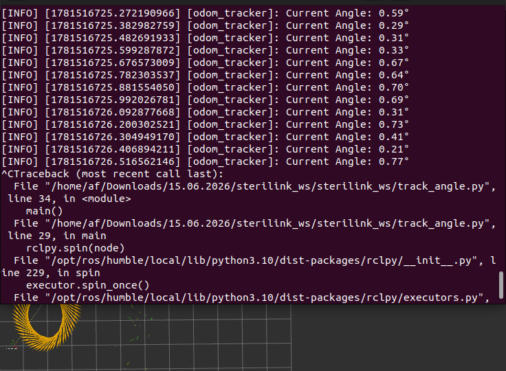

# ICP Scan-to-Scan Localization 

## Overview
This repository contains the experimental validation of scan-to-scan localization using the Iterative Closest Point (ICP) algorithm with 2D LiDAR data.

The objective of this work is to evaluate the accuracy and repeatability of pure ICP-based motion estimation in an indoor corridor environment.

At this stage, localization is performed exclusively using LiDAR scan matching, without wheel encoders, motion models, or sensor fusion.

---

## Scenario 
- STERILINK is autonomous mobile robot operates in hospital corridors to transport biohazardous waste. The robot navigates in straight paths, detects obstacles, stops when necessary, and resumes motion once the path is clear.
- The system uses a pure LiDAR-based scan-to-scan localization approach without any external tracking systems such as OptiTrack. Every 0.1 seconds (10 Hz), incoming LiDAR scans are matched with previous scans using ICP to estimate relative motion (Δx, Δy, Δθ).
- These incremental motions are accumulated to continuously estimate the robot’s relative pose [x, y, θ], enabling real-time onboard localization. This pose is used directly for navigation, obstacle handling, and motion control in the corridor environment.

---

## User Story: Localization - RViz Visualization
As a User, **I want** to visualize the robot's pose and trajectory in RViz **so that**, I can verify localization is working correctly.

---
### Acceptance Criteria
- The robot's position and orientation shall be displayed as a marker or TF frame in RViz(map → odom → base_link)
- A trajectory line of past positions shall be visible in RViz.
- The visualization shall update in real time as the robot moves..

---
## Localization Method

### Scan-to-Scan ICP
- Consecutive 2D LiDAR scans are aligned using the ICP algorithm  
- Each scan alignment produces a relative displacement  
- Relative displacements are accumulated to estimate total travelled distance  
- No odometry, motion prior, or external correction is applied  

Localization accuracy is evaluated solely by comparing ICP-estimated distance with the known ground-truth distance.

---

### Not Included
- Wheel encoder odometry  
- Kalman Filter / EKF  
- Sensor fusion  

This repository represents a **baseline evaluation** before introducing additional sensors or filtering techniques.

---

## Experimental Setup -Linear Motion

- **Environment:** Indoor corridor  
- **Path length:** 4 & 12 meters (measured using a measuring tape)  
- **Motion:** Straight-line traversal  
- **Number of trials:** 5  
- **Ground truth:** Physical measurement of distance  

The experiment was repeated multiple times to ensure consistency and reliability of the results.

---
## Corridor Testing - Short Distance(4m)

| Trial | True Distance (m) | ICP Distance (m) | Error = (True - ICP) | Error² |
|-------|--------------------|--------------------|------------------------|--------------|
| 1     | 4.00               | 3.9688             | 0.0312                 | 0.00097344   |
| 2     | 4.00               | 3.9758             | 0.0242                 | 0.00058564   |
| 3     | 4.00               | 3.9714             | 0.0286                 | 0.00081796   |
| 4     | 4.00               | 3.9599             | 0.0401                 | 0.00160801   |
| 5     | 4.00               | 3.9899             | 0.0101                 | 0.00010201   |

- **Sum of Error² = 0.00408706**
- **MSE = 0.00081741**
- **RMSE = 0.02859**

## Corridor Testing - Long Distance(12m)

| Trial | True Distance (m) | ICP Distance (m) | Error = (True - ICP) | Error² |
|-------|--------------------|--------------------|------------------------|---------------|
| 1     | 12.00              | 11.8747            | 0.1253                 | 0.01570009    |
| 2     | 12.00              | 11.6545            | 0.3455                 | 0.11937025    |
| 3     | 12.00              | 11.7642            | 0.2358                 | 0.05560164    |
| 4     | 12.00              | 11.7859            | 0.2141                 | 0.04583881    |
| 5     | 12.00              | 11.8132            | 0.1868                 | 0.03489424    |

- **Sum of Error² = 0.27140503**
- **MSE = 0.054281006**
- **RMSE = 0.233**

---

## Experimental Set - Angle Measurement - Clockwise (Loop Closure Test)

| Trial | True Angle (deg) | ICP Angle Initial (deg) | ICP Angle Final (deg) | Error = (True - ICP) | Error² |
|-------|-------------------|---------------------------|--------------------------|------------------------|----------|
| 1     | 360               | 0.6                        | 1.35                      | -0.75                   | 0.5625   |
| 2     | 360               | 0.06                       | -0.6                      | 0.66                    | 0.4356   |
| 3     | 360               | 0.13                       | 1.61                      | -1.48                   | 2.1904   |
| 4     | 360               | -0.31                      | 0.23                      | -0.54                   | 0.2916   |
| 5     | 360               | -0.45                      | 0.77                      | -1.22                   | 1.4884   |

-**Sum of Error² = 4.9685**
-**MSE = 0.9937**
-**RMSE = 0.9968**

## Experimental Set - Angle Measurement - Anticlockwise (Loop Closure Test)

| Trial | True Angle (deg) | ICP Angle Initial (deg) | ICP Angle Final (deg) | Error = (True - ICP) | Error² |
|-------|-------------------|---------------------------|--------------------------|------------------------|----------|
| 1     | 360               | -0.21                      | -1.31                     | 1.1                     | 1.21     |
| 2     | 360               | -0.1                       | -1.61                     | 1.51                    | 2.2801   |
| 3     | 360               | -0.11                      | -2.73                     | 2.62                    | 6.8644   |
| 4     | 360               | -0.15                      | -1.91                     | 1.76                    | 3.0976   |
| 5     | 360               | -0.17                      | -2.53                     | 2.36                    | 5.5696   |

- **Sum of Error² = 19.0217**
- **MSE = 3.80434**
- **RMSE = 1.95**

  

---

## Interpretation
- * ICP systematically underestimates corridor distance, with RMSE ≈ 2.86 cm (short) and ≈ 23.3 cm (long) — error increases with distance.
- * Anticlockwise drift is consistently same-signed (RMSE ≈ 1.95°); clockwise drift is more variable (RMSE ≈ 0.9968°).

This behavior is typical in corridor environments where **parallel walls provide weak longitudinal constraints** for scan matching.

---
## Limitations
* Not good for long corridors - Parallel  walls look the same everywhere, the algorithm struggles to find the  distance between the 2 Consecutive points along the corridor.
* ICP can get stuck on a wrong alignment if the starting guess is too far off, instead of finding the correct one - known as a local minimum.
* ICP needs enough overlap between scans to work; if the robot moves too fast, matching can fail.
* Small errors from each scan match add up over time, causing drift in loop closure. 

> **Note:** This implementation is intended as a baseline system, not a final localization solution.

---

##  Future Work
Planned improvements include:

- Wheel encoder integration  
- Extended Kalman Filter (EKF)  
- Bias correction  
- Long-term trajectory evaluation  
  
---

## Conclusion
This project evaluated the accuracy of an ICP-based localization system through corridor distance tests and loop closure angle tests. Results show that ICP systematically underestimates distance, with error increasing for longer distances (RMSE ≈ 2.86 cm for 4 m, ≈ 23.3 cm for 12 m), and exhibits angular drift after a full 360° rotation (RMSE ≈ 1.95° anticlockwise, ≈ 0.997° clockwise). These results highlight known limitations of ICP in feature-poor environments like corridors. The system serves as a working baseline, with future improvements such as sensor fusion and drift correction expected to improve long-term accuracy..

---

## Inputs

| Topic Name | Message Type | Description |
|-----------|------------|------------|
| /static_map | nav_msgs/OccupancyGrid.msg | odom frame |
| /ackermann_drive_feedback | ackermann_msgs/AckermannDrive.msg | Robot motion feedback in base_link frame (vehicle frame): speed and steering angle for motion prediction using Ackermann kinematics. |
| /scan | sensor_msgs/LaserScan.msg | Raw LiDAR measurements use to estimate object boundaries and distance information.  |

## Outputs

| Topic Name | Message Type | Description |
|-----------|------------|------------|
| /odom | nav_msgs/Odometry.msg | Estimate relative robot pose and velocity . Used by Path Planning and Trajectory Planning. |

- `ROS 2` (Humble or later)  
- `Python` 3.10+
-----

---

  

