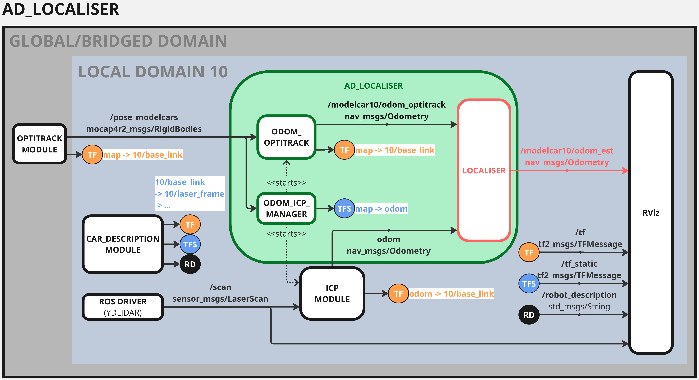
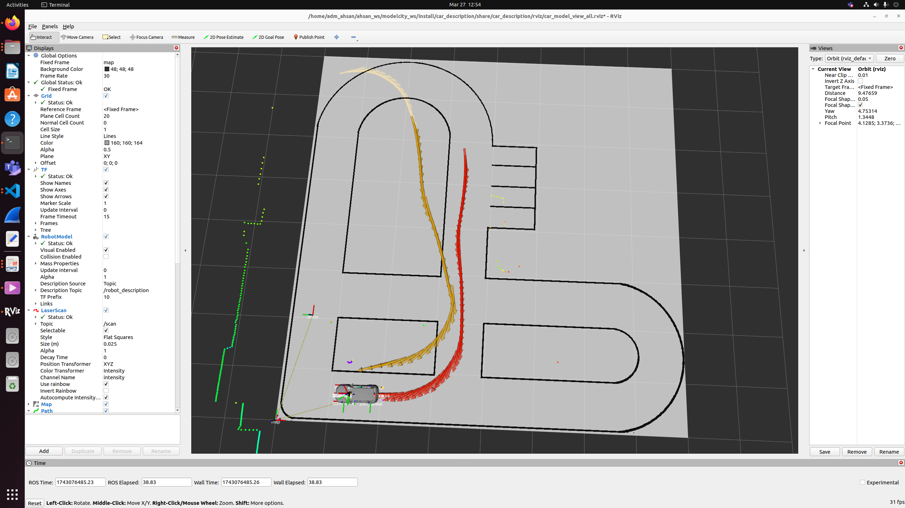

# AD LOCALISER

This repository provides ROS nodes for localising the modelcars in modelcity.

  


Start the nodes with:
```
# ros2 run ad_localiser <node_name> [--ros-args [-p <param1>:=<value1>] ...]
# see Usages
```

Available nodes are:

<table>
    <tr><th>node names</th><th>descriptions</th></tr>
    <tr>
        <td>odom_optitrack</td>
        <td>
            <table>
                <tr><td>ROLES</td><td>Compute and publish odometry from pose generated by optitrack system.</br>
                                      If required, compute and broadcast TF of selected model car w.r.t. modelcity origin <code>map</code>.</br>
                                      &emsp;(The optitrack system should already publish this TF, so it is disabled by default.)
                </tr>
                <tr><td>SUB</td><td><code>/pose_modelcars [mocap_msgs/RigidBodies]</code></tr>
                <tr><td>PUB</td><td>e.g. for carID=10</br><code>/modelcar10/odom_optitrack [nav_msgs/Odometry]</code></tr>
                <tr><td>ARGS</td><td><b>publish_tf:</b></br>
                                     &emsp;&emsp;<code>map->carID/baselink</code> is required for visualizing odom on map. Set to True, if absent.</br>
                                     <b>car_id:</b></br>
                                     &emsp;&emsp;If not set, then current ROS_DOMAIN_ID will be used as carID.
                </tr>
            </td></table>
        </td>
    </tr>
    <tr>
        <td>localiser_manager</td>
        <td>
            <table>
                <tr><td>ROLES</td><td>Manage and start localiser nodes for selected sensor odometry (see <b>odom_selection</b>).</br>
                                      &emsp;&emsp; If <b>odom_optitrack_enabled</b>, start the odom_optitrack node.</br>
                                      &emsp;&emsp; If <b>odom_icp_enabled</b>, start the odom_icp module (see <a href="./master/docs/INSTALL_DEPENDENCIES.md">Dependencies</a>).</br>
                                      Depending on when the node is started, broadcast the origin of sensor odometry</br>
                                      &emsp;&emsp; w.r.t. modelcity origin <code>map</code> (useful for visualisation on map).</br>
                                      Manage TF conflicts according to ROS arguments.
                </tr>
                <tr><td>SUB</td><td><code>/pose_modelcars [mocap_msgs/RigidBodies]</code></tr>
                <tr><td>ARGS</td><td><b>tf_opti_absent:</b></br>
                                     &emsp;&emsp;<code>map->carID/baselink</code> is required for visualizing odom on map. Set to True, if absent.</br>
                                     <b>car_id:</b></br>
                                     &emsp;&emsp;If not set, then current ROS_DOMAIN_ID will be used as carID.</br>
                                     <b>odom_selection:</b></br>
                                     &emsp;&emsp;bit0: odom_optitrack_enabled</br>
                                     &emsp;&emsp;bit1: odom_icp_enabled</br>
                                     &emsp;&emsp;bit2 .. : reserved</br>
                                     &emsp;&emsp;e.g. 0=NONE; 1=ODOM_OPTITRACK_ONLY; 2=ODOM_ICP_ONLY; 3=BOTH;
                </tr>
            </td></table>
        </td>
    </tr>


</table>

Notes:  
> *As discussed in [Resulting TF Frames](./docs/TF_FRAMES.md), a child frame cannot have multiple parent e.g. broadcasting both `map->carID/base_link` and `odom->carID/base_link` at the same time is not possible and therefore will cause unwanted behaviour. To handle this, you may use the **localiser_manager** node and set the parameters accordingly.*  

## USAGES

##### 1. Start required modules (or replay rosbag files)
- Start optitrack module to publish `/pose_modelcars`
- Start ydlidar module to publish `/scan`  (required for odom_icp)

##### 2. Start localiser_manager node
```
#ODOM_OPTITRACK_ONLY
ros2 run ad_localiser localiser_manager --ros-args -p odom_selection:=1
```
```
#ODOM_ICP_ONLY
ros2 run ad_localiser localiser_manager --ros-args -p odom_selection:=2
```
```
#BOTH
ros2 run ad_localiser localiser_manager --ros-args -p odom_selection:=3
```
```
#if TF `map->carID/baselink` is required but not available, we can also generate it by setting tf_opti_absent to True e.g.
ros2 run ad_localiser localiser_manager --ros-args -p tf_opti_absent:=True -p odom_selection:=3
```

##### 3. Start car_description
- Launch the car description to broadcast sensor frames relative to base_link
```
#with RViz
ros2 launch car_description visualize_all.launch.py
```
```
#without RViz
ros2 launch car_description publish_model.launch.py
```

##### 4. Start map_server
```
cd <path/to/model_city_map/mc24.yaml>
```
```
ros2 launch nav2_bringup localization_launch.py map:=$(pwd)'/mc24.yaml'
```

  


## DOCUMENTATIONS
- [Install Dependencies](./docs/INSTALL_DEPENDENCIES.md)
- [Resulting TF Frames](./docs/TF_FRAMES.md)

## TROUBLESHOOTING

<table>
    <tr><th>Issues</th><th>Solutions</th></tr>
    <tr><td>RobotModel won't show</td>
        <td>Change TF Prefix to your car ID</td>
    </tr>
    <tr><td>odom/scan topics won't show</td>
    <td>Ensure that the topics QOS are correct. </br>
        Check the topic QoS e.g. <code>ros2 topic info /odom --verbose</code></td>
    </tr>
    <tr><td>odom_optitrack publishes empty</td>
        <td>Please start the odom_optitrack node prior to any subscriber to odom topic e.g. RViz, rqt, ...</br>
            Current odom_optitrack creates and publishes new topics only if it is not available.</br>
            Opening RViz or RQT or any subscriber to this topic prior to odom_optitrack node will retain the topic. </br>
            &emsp;&emsp;Therefore, it will be seen as available eventhough it is not.</td></tr>
    <tr><td>map frame does not exist</td>
        <td>Please use the correct ROS arguments. For example, set tf_opti_absent to True if <code>map->carID/base_link</code> does not exist.</td>
    </tr>
    <tr><td>RobotModel jumps around map</td>
        <td>This is a known issue for current program. Since both optitrack and ICP modules publish the odometry w.r.t. map -- either directly or indirectly.</td>
    </tr>
</table>