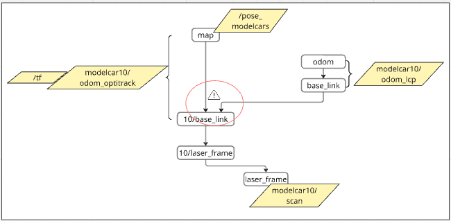
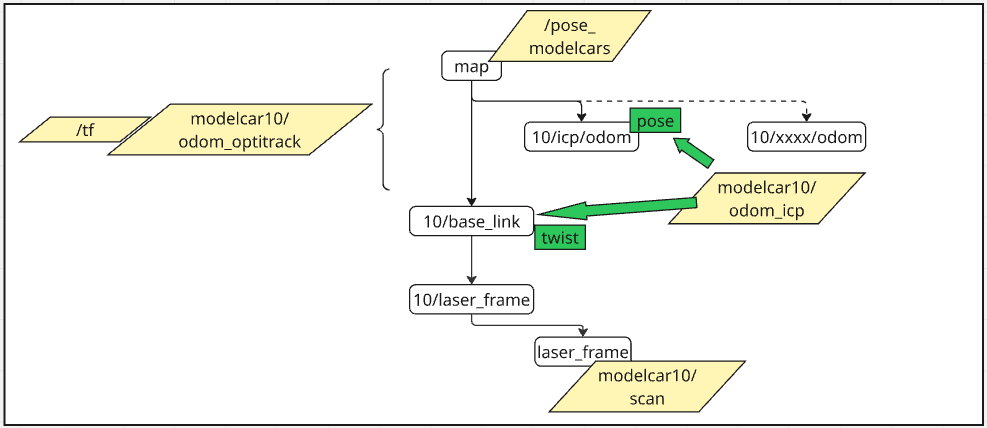
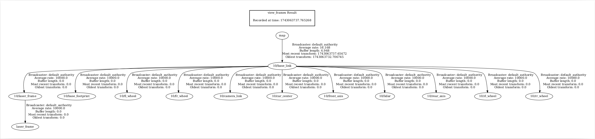
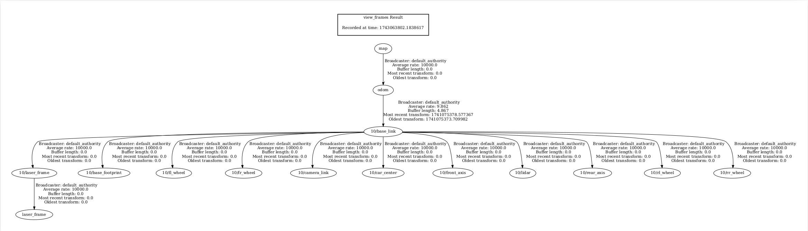
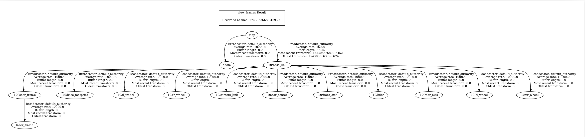

# TF FRAMES

## CONSIDERATIONS

- A parent frame can have multiple child frame, but each child can only have one parent.  

- An odometry topic can be sent to indirectly linked parent and child frame.  

## RESULTING FRAMES
### ODOM SELECTION = 1 (ODOM_OPTITRACK_ONLY)

### ODOM SELECTION = 2 (ODOM_ICP_ONLY)
  

### ODOM SELECTION = 3 (BOTH)
  