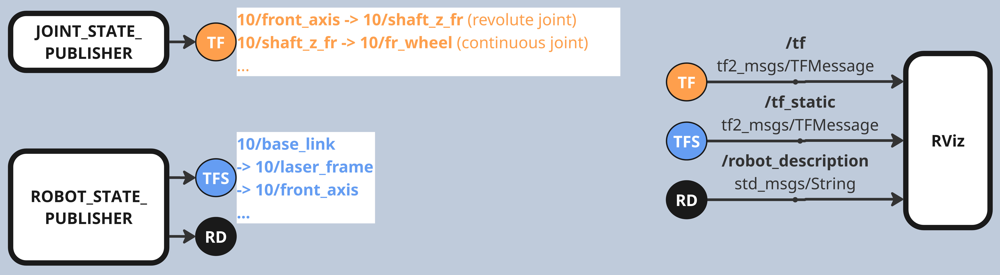

# CAR DESCRIPTION

This repository provides the launch files for publishing and visualizing the states of static and dynamic frames in the model car relative to its origin, also known as base link. The frames represent coordinate systems associated with sensors, actuators, chassis components and body structures.

## Features

> NOTE: The TF2 coordinates are currently only estimated values.



<p float="left">
   
   
</p>

<table>
   <tr><th>FEATURES</th><th>DESCRIPTIONS</th></tr>
   <tr><td>MESHES</td><td>Landrover Evoque Car Model, ~(800x400x400)mm³, ~1:5 scale ratio</td></tr>
   <tr><td>URDF  </td><td>Defines the coordinate frames of the car.</br>
                          <code>xacro</code> package is used to separate the descriptions of sensors, actuators, body and chassis coordinates.</br>
                          &emsp;&emsp;It also allows setting different parameters from arguments.</br>
                      </td></tr>
   <tr><td>LAUNCH</br>NODES</td><td>Different launch files are provided to start different nodes:</br>
                                    <b>robot_state_publisher</b></br>
                                    &emsp;&emsp; Reads the URDF file and publish <code>/robot_description</code> and <code>tf_static</code> topics.</br>
                                    &emsp;&emsp; The <code>/robot_description</code> contains the information of all static and dynamic joints.</br>
                                    &emsp;&emsp; The <code>/tf_static</code> topic contains the current transformation w.r.t. static joints.</br>
                                    <b>joint_state_publisher</b></br>
                                    &emsp;&emsp; Reads the URDF file output and publish <code>/tf</code> topics.</br>
                                    &emsp;&emsp; The <code>/tf</code> topic contains the current transformation w.r.t. dynamic joints.</br>
                                    &emsp;&emsp; The <code>joint_state_publisher_gui</code> alternative also provides GUI to control and </br>
                                    &emsp;&emsp; publish the states of individual joints.</br>
                                    <b>rviz2</b></br>
                                    &emsp;&emsp; Visualizes the ROS topics.</br>
                                    &emsp;&emsp; The <code>/tf</code> and <code>/tf_static</code> topics are used to display the pose of each </br>
                                    &emsp;&emsp; car components relative to the main frame at a given time.</br>
                                    &emsp;&emsp; The <code>/robot_description</code> inputs the RobotModel plugins with the full TF trees.</br>
                                    &emsp;&emsp; Each link may be associated to individual material and collision boxes.
                                </td></tr>
   <tr><td>LAUNCH</br>ARGS </td><td><b>car_id</b></br>
                                    &emsp;&emsp;OPTIONAL, if not given, then current ROS_DOMAIN_ID will be used.</br>
                                    &emsp;&emsp;List of car IDs are supported. <code>car_id:=1,2,3,4</code></br>
                                    <b>visual_only</b></br>
                                    &emsp;&emsp;If true, then all dynamic joints will be replaced with static ones.</br>
                                    &emsp;&emsp;For example, when visualising the individual joint motions are unnecessary.</br>
                                    &emsp;&emsp;If false, then the joint TF is also expected (e.g. from joint state publisher) </br>
                                    &emsp;&emsp;&emsp;&emsp;to visualize the model car fully.</br>
                                    <b>model</b></br>
                                    &emsp;&emsp;OPTIONAL, if not given, then the default URDF will be used. </br>
                                    &emsp;&emsp;You may require different URDF for different model.</br>
                                    <b>rvizconfig</b></br>
                                    &emsp;&emsp;OPTIONAL, if not given, then the default rviz config will be used.</br>
                                    <b>gui (only for joint_test)</b></br>
                                    &emsp;&emsp;OPTIONAL, if not given, then the default value (true) will be used.</br>
                                    &emsp;&emsp;If true, then <code>joint_state_publisher_gui</code> will be called.</br>
                                    &emsp;&emsp;Else, the <code>joint_state_publisher</code> will be called.</br>
   
   </td></tr>
</table>


## Installation

Install the dependencies with:
```sh
sudo apt install ros-$ROS_DISTRO-xacro  #required!
sudo apt install ros-$ROS_DISTRO-robot-state-publisher  #required!
sudo apt install ros-$ROS_DISTRO-joint-state-publisher
sudo apt install ros-$ROS_DISTRO-joint-state-publisher-gui
```

Like any ROS source packages, you may clone, build and source this package before executing the launch files.

## Usages

First set your ROS_DOMAIN_ID to your car ID
```sh
export ROS_DOMAIN_ID=<yourCarID>  
```

#### PUBLISH MODEL
To launch **robot_state_publisher** without any GUI, simply run

```bash
# By default, your ROS_DOMAIN_ID will be the prefix of your robot_description
ros2 launch car_description publish_model.launch.py
```
```bash
# You may also use different id than the ROS_DOMAIN_ID as such
ros2 launch car_description publish_model.launch.py car_id:=10
```
```bash
# or multiple model cars
ros2 launch car_description publish_model.launch.py car_id:=4,10
```

#### PUBLISH AND VISUALIZE MODEL
To launch **robot_state_publisher** with RViz GUI, simply run

```bash
# As above, your ROS_DOMAIN_ID will be the default prefix.
ros2 launch car_description visualize_model.launch.py
```
```bash
# You may also use different id than the ROS_DOMAIN_ID as such
ros2 launch car_description visualize_model.launch.py car_id:=10
```
```bash
# or multiple model cars
ros2 launch car_description visualize_model.launch.py car_id:=4,10
```

#### PUBLISH AND VISUALIZE MODEL + CUSTOM CONFIGURATION
The following commands eventually run the visualize_model launch, but with different configurations:

```bash
# An equivalent of
# ros2 launch car_description visualize_model.launch.py rvizconfig:=<FULL/PATH/TO/PKG/rviz/car_model_view_laserscan.rviz>
ros2 launch car_description visualize_laserscan.launch.py
```
```bash
# An equivalent of
# ros2 launch car_description visualize_model.launch.py rvizconfig:=<FULL/PATH/TO/PKG/rviz/car_model_view_all.rviz>
ros2 launch car_description visualize_all.launch.py
```

#### JOINT TEST

If you want to test the individual joints, you can use following command:

```bash
ros2 launch car_description joint_test.launch.py
```

## KNOWN ISSUES  
- For some in reason in foxy (even with the right launch arguments), you may not be able to see all cylindrical material such as the wheels. The solution is not known. But, you shall still see and work with the complete TF tree.
- You may sometime see `malform launch configuration ...` error. It is not clear what is the cause of this, but you may use the alternative command `ros2 launch <FULL/PATH/TO/LAUNCH/FILE>`.

